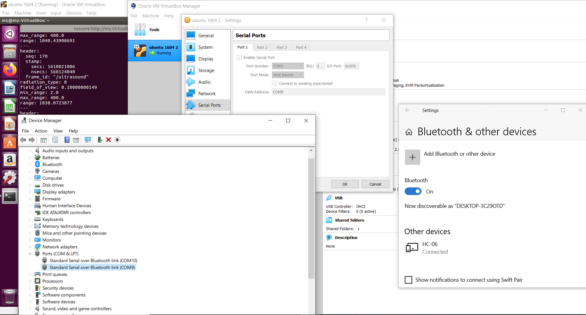

## Buddy Robot Dance with ROS
This was a fun project to get a robot to dance using ROS. I used a robot from Slant Concepts and recoded it to work with ROS, via rosserial and a bluetooth connection.    
    

[Here's](https://www.littlearmrobot.com/buddy.html) the robot I bought which came with the arduino hardware, the 3d printed parts, and some example arduino code (that I ended up reworking, but was helpful as a base). Use caution before ordering from them because their blog says as of November 2020 they disbanded the company. That said, they were still selling kits when I ordered in December.    

### Details on ROS Setup
I did this on Ubuntu 16.04 and ROS Kinetic (using a virtual machine). The connection to the Buddy robot is via ROS Serial, and the Buddy robot (and its Arduino Nano) is both a publisher (of Ultrasound ranges) and subscriber (to tone and servo movement). I added a bluetooth HC-06 module to the robot.

### Setting up a workspace
This repo is structured as a catkin workspace. To use it, create and build a workspace using something like the below:    
```
mkdir -p ~/catkin_ws_buddy/src
cd ~/catkin_ws_buddy/src
git clone https://github.com/MZandtheRaspberryPi/ros_buddy.git
cd ~/catkin_ws_buddy
catkin_make
```    

### Setting up the Buddy Robot
Follow the instructions that came with your buddy robot on assembly, but leave it cracked open at the end. From here, you'll need to put the arduino code onto the buddy robot. To do this, you'll need to use ROS to generate arduino code for some custom messages used. Navigate to where you've setup your arduino folder (sketchbook represents this path, so replace that).    
```
source ~/catkin_ws_buddy/devel/setup.bash
cd <sketchbook>/libraries
rm -rf ros_lib
rosrun rosserial_arduino make_libraries.py .
```    
This should generate the arduino code for the custom messages. Then you open the file buddy_arduino_code.ino from the folder buddy_arduino_code and upload this onto your buddy robot using a wired usb connection (the robot may have to be apart for this step).

### Running the Dance using ROS

From here, launch one terminal window and start roscore:    
```
roscore
```    

Start a second terminal window, and run the serial node. For this to work you'll need to have the bluetooth connection to the buddy robot working, so see the section below for details there. If yours is connected to a different serial port than /dev/ttyS0 replace it with your port.    
```
rosrun rosserial_python serial_node.py /dev/ttyS0 _baud:=9600
```    

From here, you can run the rose node that will do the dance in a third terminal window, and ctrl + c to exit it when you're done.    
```
rosrun buddy_control buddy_dance
```


### Details on Bluetooth Connection
I was on a virtual machine, so what I did is as follows. With the virtual machine shut down, I paired with the HC-06 using Windows and the bluetooth menu. Then I opened device manager and checked what COM ports were in use. I picked the lowest one, and input that into my virtual machine settings in terms of using the HOST serial port, and giving it to the guest machine. From here, I could access it using the address /dev/ttyS0.    
    

Subscriber:
http://wiki.ros.org/ROS/Tutorials/WritingPublisherSubscriber%28c%2B%2B%29

http://wiki.ros.org/rosserial_client/Tutorials/Generating%20Message%20Header%20Files custom message gen arduino

http://wiki.ros.org/ROS/Tutorials/CreatingMsgAndSrv ros msg creation

mz@mz-VirtualBox:~$ rosmsg show buddy_msg/buddy_control
uint8 baseServoAngle
uint8 nodServoAngle
uint8 tiltServoAngle
uint8 desiredDelay
uint8 wordCount


mz@mz-VirtualBox:~$ rostopic pub -l /buddyControl buddy_msg/buddy_control -- 90 110 110 3 3
publishing and latching message. Press ctrl-C to terminate

